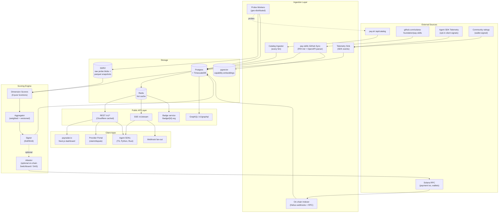

# PayRadar — Product & Engineering Specification

**Version:** 0.1 (Foundation Spec)
**Date:** 2026-05-09
**Owner:** CBas
**Status:** Pre-build / RFC

---

## Table of Contents

1. [Product Requirements Document (PRD)](#1-product-requirements-document)
2. [System Architecture](#2-system-architecture)
3. [Data Schema](#3-data-schema)
4. [Trust & Discovery Scoring Model](#4-trust--discovery-scoring-model)
5. [Tech Stack & Project Structure](#5-tech-stack--project-structure)
6. [Roadmap & Open Questions](#6-roadmap--open-questions)

---

## 1. Product Requirements Document

### 1.1 Vision

> **PayRadar is the trust layer that lets autonomous AI agents — and the humans who deploy them — discover, evaluate, and safely transact with the right pay-as-you-go API on Solana, in milliseconds, with cryptographic receipts.**

The pay.sh ecosystem is exploding: ~72 providers, ~834 endpoints, growing weekly. But:

- **Agents are flying blind.** They pick endpoints from `PAY.md` files with no idea which providers are reliable, fairly priced, secure, or even alive.
- **Humans lack a single pane of glass.** Ranking, comparison, and audit trails are scattered across GitHub, the catalog endpoint, and ad-hoc Twitter threads.
- **The existing competitor (`radar.infopunks.fun`) is degraded.** It surfaces basic trust/signal scores but is not transparently auditable, not fully machine-readable, and is not optimized for autonomous agent consumption (no signed scores, no streaming feeds, no SLA history).

PayRadar fills this gap as an **opinionated, transparent, agent-first intelligence layer** — think *CoinGecko + Schelling-point oracle + DefiLlama, but for paid agent APIs*.

### 1.2 Mission Statement

Provide a **transparent, auditable, real-time, agent-consumable** trust + discovery feed over every pay.sh endpoint, so that:

- **Agents** can autonomously rank and select endpoints with confidence (and recover when one degrades).
- **Humans** can debug, compare, and govern the API supply they expose to their agents.
- **Providers** have a clear, gameable-resistant scoreboard that incentivizes uptime, fair pricing, and security hygiene.

### 1.3 Target Users & Personas

| Persona | Primary Need | How They Consume PayRadar |
|---|---|---|
| **Aria — Autonomous Agent** (the *first-class user*) | Pick the cheapest reliable endpoint matching a capability, in <50ms, with a signed score it can audit. | Streaming JSON-over-SSE feed + signed score attestations + capability search (`/v1/discover?capability=geocode&max_price_usd=0.001`). |
| **Dev Dani — Solo dev / agent operator** | Build agents that don't go down because one provider rugs. Compare 4 geocoding APIs side-by-side. | Web dashboard, comparison tables, alert webhooks, embeddable badges. |
| **Provider Priya — pay-skill author** | Rank well. Understand why score dropped. Differentiate from competitors. | Provider portal: score breakdown, historical SLA, dispute mechanism, badge embed. |
| **Treasury Tom — Org buying agent infra** | Know that the APIs his agents pay for are not malicious, not overpriced, and have on-chain reputation. | Compliance reports, exportable audits, on-chain attestation queries, allow/deny lists. |
| **Researcher Rin — Ecosystem analyst** | Track ecosystem health, capability gaps, pricing trends. | Public datasets, GraphQL API, time-series endpoints. |

### 1.4 User Stories

#### As an Autonomous Agent (Aria)
- **AS-1:** Given a capability `"image-to-text"` and budget `$0.0005/call`, I want a ranked list of endpoints with signed trust scores so I can pick one without re-evaluating every minute.
- **AS-2:** When my chosen endpoint returns a 5xx or breaks SLA, I want a webhook/SSE event within 60s so I can hot-swap.
- **AS-3:** I want every score to be cryptographically signed by PayRadar's oracle key (and ideally co-signed on-chain) so I can prove to my principal *why* I picked provider X.
- **AS-4:** I want a `/v1/health/{endpoint_id}` lightweight endpoint that returns just `{status, score, last_probe}` so I can poll cheaply.
- **AS-5:** I want a deterministic tiebreaker (e.g., provider hash) so two agents with identical inputs pick the same provider — useful for reproducibility.

#### As a Human Developer (Dev Dani)
- **DD-1:** I want to search the catalog by capability, price band, and minimum trust score, and see a comparison view.
- **DD-2:** I want to subscribe to "any geocoding endpoint with score > 80" so I get notified when new ones appear.
- **DD-3:** I want to see *why* a score is what it is (full breakdown, weights, raw probe data).
- **DD-4:** I want to pin a provider to my workspace and get email/Discord alerts on score drops > 10 points.
- **DD-5:** I want a one-line embed `<script src="payradar.io/badge/{id}.js">` for my own docs.

#### As a Provider (Priya)
- **PP-1:** I want to claim my listing, verify ownership (sign a Solana message), and see my private analytics.
- **PP-2:** I want to dispute a score decrement with evidence (probe logs, RPC traces).
- **PP-3:** I want to see *which probes are currently failing* and a remediation hint.
- **PP-4:** I want to publish proactive uptime SLA + pricing commitments that PayRadar will track.

#### As a Treasury / Compliance User (Tom)
- **TT-1:** I want to download a signed audit pack: "Here is every API my agents called last month, the score at the time, and the on-chain payment hash."
- **TT-2:** I want a configurable allow-list / deny-list pushed to my agent fleet.
- **TT-3:** I want flag indicators for: known phishing domains, sanctioned wallet recipients, suspicious pricing.

### 1.5 Differentiation vs. radar.infopunks.fun

| Dimension | Infopunks Radar (current) | **PayRadar** |
|---|---|---|
| Score auditability | Opaque single number | **Open formula, weighted breakdown, all raw probe data downloadable** |
| Agent-first surface | HTML dashboard | **Signed JSON API + SSE stream + on-chain attestation** |
| Score signing | None | **Ed25519 + optional on-chain attestation (Switchboard / Solana Attestation Service)** |
| Update cadence | Sporadic / degraded | **Active probes every 5 min for hot endpoints, hourly for long-tail; push events on state change** |
| Dimensions | ~2 (trust, signal) | **8+ (trust, signal, reliability, pricing-value, security, latency, adoption, on-chain reputation, freshness)** |
| Provider portal | None | **Claim flow, dispute mechanism, badge embed, private analytics** |
| Capability search | Basic | **Semantic + structured, OpenAPI-aware, capability taxonomy** |
| On-chain integration | None | **Tracks payment recipient wallets, payment volume, refund/dispute rate** |
| Reproducibility | None | **All scores versioned; replay engine reproduces any historical score** |
| Open data | None | **Public Parquet snapshots + GraphQL** |
| Governance / disputes | None | **Structured dispute pipeline with public audit log** |

### 1.6 Success Metrics (90 / 180 / 365 days)

| KPI | T+90 | T+180 | T+365 |
|---|---|---|---|
| Catalog coverage (% pay.sh endpoints scored) | 100% | 100% | 100% |
| Score freshness P50 (active endpoints) | < 15 min | < 5 min | < 60s |
| Agent SDK installs (npm + pip) | 100 | 1,000 | 10,000 |
| Daily signed-score requests | 10k | 1M | 50M |
| Providers who claimed listing | 10% | 40% | 70% |
| Uptime of PayRadar API | 99.5% | 99.9% | 99.95% |
| Disputes resolved < 72h | 80% | 95% | 99% |
| Verified on-chain attestation usage | — | 5% of reads | 30% of reads |

### 1.7 Non-Goals (v1)

- Becoming a payment processor or wallet (pay.sh handles that).
- Hosting or proxying API calls (creates honeypot risk + latency).
- Ranking general-purpose APIs outside the pay.sh universe.
- Subjective "quality" judgments (e.g., "is this LLM smart?"). We score *operational* trust, not output quality — though we surface community ratings.

### 1.8 MVP Definition (v0 — what we ship first)

**Refined scope after kickoff review (2026-05-09):** the v1 spec above is the *target*; v0 is what we cut to get a useful, deployable artifact in ~3 weeks.

**In scope for v0:**
- Catalog ingestor (pulls `pay.sh/api/catalog` on a Vercel cron, diffs, upserts to Supabase).
- Scoring engine with **only two dimensions**: `reliability` and `latency`, each emitting `{score, confidence, evidence_count, version}`.
- Simple liveness-only probe (no synthetic paid calls).
- Public `/v1/discover` REST endpoint (Next.js Route Handler, edge-cached).
- Next.js dashboard with one page: `/discover` (capability + min score filter, table view).
- Supabase Postgres for storage; Vercel for compute; everything serverless.
- **Open-source scoring engine** as a standalone npm package (`@payradar/scoring-engine`) under MIT from day 1 — pinned to a versioned formula, fully replayable.

**Deferred to v1+:**
- Synthetic paid probes (cost + x402 wallet management).
- On-chain attestations (Switchboard / SAS).
- Trust/signal/security/pricing-value/community/on-chain dimensions (stub them as zero-weight in v0).
- Provider portal, claim flow, disputes.
- SDKs (TS/Python/Rust) — agents can hit the REST API directly for v0.
- pgvector capability search — use exact-match `array_contains` on `capabilities` for v0.
- Rust probe workers — replaced by a Node cron in v0.

**Confidence-as-first-class signal.** Every dimension score now ships with a `confidence ∈ [0,1]` derived from sample size and recency. The aggregator weights by `weight × confidence`, so under-evidenced dimensions naturally fade. This is the single most important addition vs. the v1 spec — agents *must* know how trustable the score itself is.

**Deployment.** Vercel (web + API + cron) + Supabase (Postgres + Auth + future Realtime). One repo, one deploy. No Cloudflare/Fly/Hetzner until we outgrow Vercel.

### 1.9 Risks & Mitigations

| Risk | Mitigation |
|---|---|
| Provider gaming probes (whitelist PayRadar IPs to fake uptime) | Rotating probe sources (Akamai, Cloudflare, residential, on-chain RPC); blind-probe via agent SDK telemetry; client-attested sampling. |
| Score manipulation lawsuits | Transparent formula, public dispute log, "computed signal not editorial opinion" framing, Section 230-style ToS. |
| Sybil community ratings | wallet-bound + Solana-attestation gated; decay; weight by on-chain pay history with that provider. |
| Becoming a single point of trust failure | Open data, reproducible scores, multi-oracle co-signing roadmap. |
| pay.sh schema changes break ingestion | Schema-versioned ingestor, contract tests against catalog endpoint, n-1 backwards compatibility. |

---

## 2. System Architecture

### 2.1 High-Level Component Diagram (Mermaid)



### 2.2 Component Responsibilities

#### Ingestion Layer
- **Catalog Ingestor** — pulls `https://pay.sh/api/catalog` every 5 min, diffs against last snapshot, emits `provider.created | provider.updated | endpoint.removed` events.
- **pay-skills GitHub Sync** — clones / `git fetch` the registry hourly, parses `PAY.md` + OpenAPI YAML, extracts capability tags, embeds them via `text-embedding-3-large` (or local `bge-large`) into pgvector.
- **On-chain Indexer** — subscribes via Helius webhooks to payment recipient wallets discovered via catalog, also re-checks balances/tx history on-demand. Tracks: payment volume, distinct payers, refunds, age of wallet, related wallets.
- **Probe Workers** — geo-distributed (US-East, EU-West, AP-South). Each endpoint gets:
  - **Liveness probe** (cheap GET / OPTIONS, every 5m for hot, hourly for long-tail).
  - **Synthetic transaction** (paid call from PayRadar's funded x402 wallet, sampled 1× per day per endpoint, more often for top-tier).
  - **Security probe** (TLS chain, header hygiene, CORS, rate-limit headers).
- **Telemetry Sink** — agent SDK emits `{endpoint_id, latency_ms, status_code, hash(request_shape)}` events. Privacy-preserving (no payloads). Heavily weighted because it's real-world signal.

#### Storage
- **Postgres + TimescaleDB** — primary OLTP store. Hypertables for `probes`, `scores_history`, `payments`, `telemetry`. Continuous aggregates for hourly/daily rollups.
- **S3/R2** — raw probe artifacts (response headers, TLS certs), nightly Parquet exports of public datasets.
- **Redis** — hot cache for `/v1/discover` and `/v1/score/{id}` (TTL 30s), pub/sub fan-out for SSE.
- **pgvector** — capability embeddings for semantic search.

#### Scoring Engine
- **Dimension Scorers** — 8+ pure, deterministic functions taking a `ProviderEvidence` struct → `DimensionScore`. Versioned (`v1.2.0`).
- **Aggregator** — weighted sum with explicit version tag; emits `Score` record with full breakdown.
- **Signer** — Ed25519 sign over canonical JSON of the score. Public key published at `payradar.io/.well-known/payradar-keys.json`.
- **On-chain Attestor (optional, for premium consumers)** — writes a hash of the score to Solana via Switchboard or Solana Attestation Service every N blocks.

#### Public API
- **REST** — Cloudflare-cached, the workhorse: `/v1/providers`, `/v1/endpoints/{id}`, `/v1/discover`, `/v1/score/{id}`, `/v1/score/{id}/proof`.
- **SSE** — `/v1/stream?subscribe=endpoint:abc,capability:geocode` for hot-swap notifications.
- **GraphQL** — for analysts and the dashboard.
- **Badge service** — SVG/HTML for embeds.

### 2.3 Data Flow: A Single Score Update

```
1. Probe Worker (us-east) pings endpoint E at T0.
   → 200 OK, 142ms, valid TLS, paid synthetic call succeeded.
   → Writes ProbeRecord to Postgres + raw blob to S3.

2. Trigger fires (NOTIFY 'evidence_updated' on Postgres).

3. Scoring Engine pulls last 24h evidence for endpoint E:
   - liveness samples
   - latency distribution (p50/p95/p99)
   - on-chain payment volume + payer diversity
   - recent disputes
   - community ratings (decayed)
   - github commit recency for the pay-skill

4. Each of 8 dimension scorers runs (pure, deterministic, versioned).

5. Aggregator combines → final 0-100 score with breakdown.

6. Signer signs canonical JSON.

7. If score delta > 5 pts OR state crosses tier threshold:
     → write to scores_current + scores_history
     → publish to Redis pub/sub channel "endpoint:E"
     → SSE subscribers receive event in <1s
     → optional: on-chain attestation enqueued (rate-limited)

8. Cache invalidation cascades (Cloudflare purge for /v1/score/E).
```

### 2.4 Deployment Topology

- **Fly.io / Railway** for stateless services (API, ingestors, scoring workers) — cheap, multi-region.
- **Neon** (or self-hosted Postgres on Hetzner) for primary DB. TimescaleDB extension on top.
- **Cloudflare R2** for blob storage (no egress fees).
- **Cloudflare Workers** for edge cache + badge service.
- **Helius** for Solana RPC + webhooks (paid tier).
- **Probe workers** intentionally spread across multiple clouds (Fly + Hetzner + Render) to avoid IP-allowlist gaming.

---

## 3. Data Schema

All examples use `snake_case` JSON. Postgres tables mirror this.

### 3.1 Provider

```json
{
  "id": "prv_acme_geocoding",
  "slug": "acme-geocoding",
  "name": "Acme Geocoding",
  "homepage": "https://acme.example.com",
  "pay_sh_id": "acme-geocoding-v1",
  "pay_skills_repo_path": "providers/acme-geocoding",
  "claimed": true,
  "claimed_by_wallet": "9zX...PqR",
  "claimed_at": "2026-04-12T08:14:00Z",
  "categories": ["geocoding", "location"],
  "description": "Forward and reverse geocoding with global coverage.",
  "payment_recipients": [
    { "wallet": "5aB...QwE", "first_seen": "2026-01-03T00:00:00Z" }
  ],
  "endpoint_count": 4,
  "created_at": "2026-01-03T00:00:00Z",
  "updated_at": "2026-05-09T07:00:00Z"
}
```

### 3.2 Endpoint

```json
{
  "id": "ep_acme_forward_geocode",
  "provider_id": "prv_acme_geocoding",
  "operation_id": "forwardGeocode",
  "method": "POST",
  "path": "/v1/geocode/forward",
  "url": "https://api.acme.example.com/v1/geocode/forward",
  "capabilities": ["geocode.forward"],
  "capability_embedding_id": "vec_8a3...",
  "openapi_hash": "sha256:0c1f...",
  "pricing": {
    "model": "per_call",
    "amount_usd": 0.0008,
    "amount_lamports": 4000,
    "currency_token": "USDC",
    "minimum_topup_usd": 0.10,
    "last_changed_at": "2026-04-01T00:00:00Z"
  },
  "auth": {
    "scheme": "x402",
    "supports_streaming": false
  },
  "documented_sla": {
    "uptime_pct": 99.9,
    "latency_p95_ms": 300
  },
  "active": true,
  "first_seen": "2026-01-03T00:00:00Z",
  "last_seen_in_catalog": "2026-05-09T06:55:00Z"
}
```

### 3.3 Probe Record (TimescaleDB hypertable)

```json
{
  "probe_id": "prb_01HW...",
  "endpoint_id": "ep_acme_forward_geocode",
  "ts": "2026-05-09T07:14:23.812Z",
  "probe_type": "synthetic_paid",
  "source_region": "us-east-1",
  "source_class": "cloud",
  "result": {
    "ok": true,
    "http_status": 200,
    "latency_ms": 142,
    "tls_valid": true,
    "tls_expires_at": "2026-09-01T00:00:00Z",
    "payment_tx_sig": "3aB...xYz",
    "response_hash": "sha256:7e2..."
  },
  "raw_blob_uri": "r2://payradar-probes/2026/05/09/prb_01HW....json.gz"
}
```

### 3.4 Score

```json
{
  "score_id": "scr_01HW...",
  "endpoint_id": "ep_acme_forward_geocode",
  "computed_at": "2026-05-09T07:15:00Z",
  "engine_version": "1.2.0",
  "score": 87.4,
  "tier": "A",
  "dimensions": {
    "trust":            { "score": 92, "weight": 0.15, "evidence_count": 142 },
    "signal":           { "score": 84, "weight": 0.10, "evidence_count":  88 },
    "reliability":      { "score": 96, "weight": 0.20, "evidence_count": 720 },
    "pricing_value":    { "score": 78, "weight": 0.10, "evidence_count":  12 },
    "security":         { "score": 90, "weight": 0.10, "evidence_count":   6 },
    "latency":          { "score": 88, "weight": 0.10, "evidence_count": 720 },
    "community_adoption":{ "score": 71, "weight": 0.10, "evidence_count":  34 },
    "onchain_reputation":{ "score": 85, "weight": 0.10, "evidence_count": 412 },
    "freshness":        { "score": 95, "weight": 0.05, "evidence_count":   1 }
  },
  "deltas": {
    "vs_1h":   -0.2,
    "vs_24h":  +1.1,
    "vs_7d":   +3.4
  },
  "explain_url": "https://payradar.io/score/scr_01HW.../explain",
  "signature": {
    "alg": "ed25519",
    "key_id": "pr-oracle-2026-q2",
    "sig": "base58:5xK..."
  },
  "onchain_attestation": {
    "tx_sig": "4cD...vBn",
    "slot": 287412990,
    "merkle_root": "sha256:bb0..."
  }
}
```

### 3.5 Capability Taxonomy Entry

```json
{
  "capability_id": "cap.geocode.forward",
  "label": "Forward Geocoding",
  "description": "Convert addresses or place names to lat/lng coordinates.",
  "parent": "cap.location",
  "synonyms": ["address-to-coords", "geocoding"],
  "embedding_id": "vec_cap_8a3..."
}
```

### 3.6 Community Rating (wallet-signed)

```json
{
  "rating_id": "rtg_01HW...",
  "endpoint_id": "ep_acme_forward_geocode",
  "rater_wallet": "9zX...PqR",
  "rater_paid_to_provider_usd_total": 18.42,
  "stars": 4,
  "tag": "accuracy",
  "comment": "Misses Brazilian rural addresses occasionally.",
  "signature": "base58:3yT...",
  "submitted_at": "2026-05-08T12:00:00Z",
  "weight": 0.74
}
```

### 3.7 Dispute

```json
{
  "dispute_id": "dsp_01HW...",
  "endpoint_id": "ep_acme_forward_geocode",
  "opened_by_wallet": "5aB...QwE",
  "opened_at": "2026-05-09T03:00:00Z",
  "type": "score_dimension",
  "dimension": "reliability",
  "claim": "Probes from us-east-1 hit a regional outage on our cloudfront, not our origin.",
  "evidence_uris": ["r2://payradar-disputes/dsp_01HW.../cf-status.png"],
  "status": "under_review",
  "resolution": null,
  "public_log_uri": "https://payradar.io/disputes/dsp_01HW..."
}
```

---

## 4. Trust & Discovery Scoring Model

### 4.1 Design Principles

1. **Transparent.** Every scalar is reproducible from public evidence + a versioned formula.
2. **Composable.** Each dimension is a pure function; agents can re-weight for their use case.
3. **Gameable-resistant.** Mix observable on-chain signals, blind probes, and SDK-attested telemetry.
4. **Time-aware.** Recent evidence weighs more (exponential decay, half-life per dimension).
5. **Conservative on cold start.** New endpoints get a `"provisional"` flag and a capped max score until N probes accumulate.
6. **Explainable.** Every score comes with `explain_url` showing the math.

### 4.2 The Nine Dimensions

> The brief asked for at least 8 dimensions; we ship 9 because **freshness** is a critical agent-facing signal.

#### 1. Trust (15%)
*"Is this the entity it claims to be, and has anyone verified it?"*
- Domain age (WHOIS, archive.org first seen)
- TLS cert continuity (no recent issuer changes)
- Provider has claimed listing (wallet-signed) → +20
- GitHub repo for pay-skill exists, has commits, is referenced from PAY.md → +15
- Social/legal footprint (optional, manually-curated for top tier)
- Penalty: domain registered < 30 days, recent ownership changes

```
trust = clamp(0, 100,
  domain_age_score(weight=0.30)
+ tls_continuity_score(weight=0.20)
+ claimed_bonus(weight=0.20)
+ repo_existence_score(weight=0.15)
+ social_footprint_score(weight=0.15)
)
```

#### 2. Signal (10%)
*"Is the metadata complete, accurate, and useful for an agent to consume?"*
- OpenAPI completeness (% endpoints with examples, schemas, error codes)
- PAY.md quality (price documented, capabilities tagged, rate limits stated)
- Schema drift between declared and observed responses
- Capability tags resolve to known taxonomy entries

#### 3. Reliability (20%) — *highest weight*
*"Is it actually up?"*
- Liveness uptime over rolling 24h, 7d, 30d (Wilson lower-bound, not naive %).
- 5xx rate from probes + telemetry
- Synthetic-paid-call success rate (the realest signal)
- Partial credit: up but slow vs. flat-out down
- Half-life for downtime: 7 days

```
reliability = 100 * Wilson_lower_bound(successes, total, z=1.96)
              with successes weighted: telemetry=1.0, paid_synthetic=0.9, liveness=0.5
```

#### 4. Pricing Value (10%)
*"Is the price fair vs. peers offering the same capability?"*
- Compute peer set: endpoints sharing top-K capability tags AND embedding similarity > 0.85
- Score = percentile rank inverted (cheaper = higher), z-score-normalized to handle outliers
- **Important:** "free" is *not* automatically best — penalize $0 if no documented sustainability (looks like rug-bait)
- Penalize sudden price spikes > 50% within 30 days

#### 5. Security (10%)
*"Will calling this endpoint hurt me?"*
- TLS grade (Mozilla Observatory-style)
- Security headers (HSTS, CSP, no leaking debug info)
- No PII in error messages
- Rate-limit headers present and sane
- No recent CVEs / breach disclosures (manual flag)
- Recipient wallet not in OFAC / chainalysis sanctions list (off-the-shelf feed)

#### 6. Latency (10%)
*"How fast?"*
- p50 / p95 / p99 from probes + telemetry, geo-weighted
- Compute against capability peer baseline (a fast LLM endpoint will always be slower than a fast geocoder; compare like-with-like)
- Half-life: 24h
- Bonus for tight tail (low p99/p50 ratio)

```
latency_score = 100 * (1 - clamp(0, 1, p95_ms / peer_baseline_p95_ms - 1))
              + tail_tightness_bonus
```

#### 7. Community Adoption (10%)
*"Are real wallets paying for this?"*
- Distinct paying wallets (30d), log-scaled
- Total paid volume (30d), log-scaled, *capped* (a single whale ≠ adoption)
- Wallet-bound community ratings (avg, decayed, sybil-weighted)
- GitHub stars / forks of the pay-skill repo (small weight, easy to game)

#### 8. On-Chain Reputation (10%)
*"What does the recipient wallet's history say?"*
- Wallet age
- Distinct counterparty count
- Refund rate (program-detectable refunds)
- Cluster heuristics: linked wallets, suspicious mixing patterns (Helius enrichment)
- Penalty: wallet recently received from sanctioned addresses
- Bonus: wallet has Solana Attestation Service KYB attestation

#### 9. Freshness (5%)
*"How current is everything?"*
- Time since last successful probe
- Time since last catalog snapshot containing this endpoint
- Time since last OpenAPI schema update commit

### 4.3 Aggregation

```python
def aggregate(dim_scores: Dict[str, DimScore], weights: Dict[str, float]) -> float:
    weighted = sum(d.score * weights[name] for name, d in dim_scores.items())
    # Provisional cap for cold-start endpoints
    if total_evidence(dim_scores) < COLD_START_THRESHOLD:
        weighted = min(weighted, 65.0)
    return round(weighted, 1)
```

Tiers (purely cosmetic UX, derived from score):

| Tier | Score | Visual |
|---|---|---|
| **S** | ≥ 92 | gold |
| **A** | 80–91.9 | green |
| **B** | 65–79.9 | blue |
| **C** | 50–64.9 | yellow |
| **D** | 30–49.9 | orange |
| **F** | < 30 | red |
| **Provisional** | — | gray, regardless of score |

### 4.4 Custom Weights for Agents

Agents may pass `?weights=reliability:0.4,latency:0.3,pricing_value:0.3` to re-aggregate from the same evidence. PayRadar returns the custom score *and* the canonical score side-by-side, both signed.

### 4.5 Reproducibility & Audit

Each `score_id` is **fully replayable**:
- Inputs: snapshot of evidence at `computed_at`, identified by content hashes.
- Code: git SHA of the scoring engine.
- Output: deterministic given the inputs.

`/v1/score/{id}/replay` returns the full evidence bundle + Docker tag for re-running.

---

## 5. Tech Stack & Project Structure

### 5.1 Stack Choices

| Concern | Choice | Why |
|---|---|---|
| Language (services) | **TypeScript** (Node 22, Bun-runnable) for API + ingestors; **Rust** for probe workers + on-chain attestor | TS for velocity, Rust where latency/safety matters |
| Web framework | **Hono** (API) + **Next.js 15 App Router** (dashboard) | Hono is edge-friendly and Cloudflare-native; Next.js for the marketing + dashboard |
| DB | **Postgres 16 + TimescaleDB + pgvector** | One DB for OLTP, time-series, and semantic search |
| Cache / pub-sub | **Redis** (Upstash) | SSE fan-out + hot reads |
| Queue | **pg-boss** initially → **Cloudflare Queues** at scale | pg-boss reuses Postgres, zero ops |
| Object storage | **Cloudflare R2** | Zero egress |
| Solana RPC | **Helius** | Webhooks + DAS API |
| Auth (humans) | **Clerk** or **Supabase Auth** + Solana wallet linking | Wallet-first identity for providers |
| Auth (agents/API) | API keys + **wallet-signed bearer** for on-chain-aware tier | Lets agents prove their principal |
| Observability | **OpenTelemetry → Grafana Cloud / Honeycomb** | Standard |
| Errors | **Sentry** | Standard |
| Feature flags | **PostHog** (also analytics) | One vendor for product + flags |
| CI/CD | **GitHub Actions → Fly.io** | |
| Infra-as-code | **Terraform** for Fly + R2 + Cloudflare; **dbmate** for SQL migrations | Avoid Prisma for hypertables |
| SDKs | **TypeScript** (npm), **Python** (pypi), **Rust** (crates.io) | Three first-class agent SDKs |

### 5.2 Monorepo Layout

```
payradar/
├── apps/
│   ├── web/                          # Next.js 15 — public dashboard + provider portal
│   │   ├── app/
│   │   │   ├── (marketing)/
│   │   │   ├── (dashboard)/
│   │   │   │   ├── discover/
│   │   │   │   ├── providers/[slug]/
│   │   │   │   └── endpoints/[id]/
│   │   │   ├── (provider-portal)/
│   │   │   │   ├── claim/
│   │   │   │   ├── disputes/
│   │   │   │   └── analytics/
│   │   │   └── (admin)/
│   │   ├── components/
│   │   └── lib/
│   │
│   ├── api/                          # Hono — public REST + GraphQL + SSE
│   │   ├── src/
│   │   │   ├── routes/
│   │   │   │   ├── v1/
│   │   │   │   │   ├── providers.ts
│   │   │   │   │   ├── endpoints.ts
│   │   │   │   │   ├── discover.ts
│   │   │   │   │   ├── score.ts
│   │   │   │   │   ├── stream.ts          # SSE
│   │   │   │   │   ├── disputes.ts
│   │   │   │   │   └── ratings.ts
│   │   │   │   └── graphql/
│   │   │   ├── middleware/
│   │   │   ├── lib/cache.ts
│   │   │   └── server.ts
│   │   └── openapi.yaml
│   │
│   ├── ingestors/
│   │   ├── catalog-sync/             # pulls pay.sh /api/catalog
│   │   ├── pay-skills-sync/          # git fetch + parse PAY.md / OpenAPI
│   │   ├── onchain-indexer/          # Helius webhooks → DB
│   │   └── telemetry-sink/           # SDK events
│   │
│   ├── probe-workers/                # Rust — geo-distributed probes
│   │   ├── src/
│   │   │   ├── liveness.rs
│   │   │   ├── synthetic_paid.rs     # actually pays via x402
│   │   │   ├── security.rs
│   │   │   └── main.rs
│   │   └── Cargo.toml
│   │
│   ├── scoring-engine/               # the math — pure, versioned
│   │   ├── src/
│   │   │   ├── dimensions/
│   │   │   │   ├── trust.ts
│   │   │   │   ├── signal.ts
│   │   │   │   ├── reliability.ts
│   │   │   │   ├── pricing-value.ts
│   │   │   │   ├── security.ts
│   │   │   │   ├── latency.ts
│   │   │   │   ├── community-adoption.ts
│   │   │   │   ├── onchain-reputation.ts
│   │   │   │   └── freshness.ts
│   │   │   ├── aggregator.ts
│   │   │   ├── signer.ts
│   │   │   ├── attestor.ts           # optional on-chain
│   │   │   └── replay.ts             # reproducibility tool
│   │   └── tests/
│   │
│   └── badge-service/                # Cloudflare Worker — SVG badges
│
├── packages/
│   ├── sdk-ts/                       # @payradar/sdk
│   ├── sdk-python/                   # payradar (pypi)
│   ├── sdk-rust/                     # payradar (crates.io)
│   ├── schema/                       # zod + JSON Schema + protobufs (single source of truth)
│   ├── capability-taxonomy/          # the controlled vocabulary
│   ├── shared-types/
│   └── ui/                           # shared React components
│
├── infra/
│   ├── terraform/
│   ├── fly/
│   └── migrations/                   # dbmate SQL files
│
├── docs/
│   ├── scoring/                      # public, versioned: explain v1.2.0
│   ├── api/
│   └── governance/                   # disputes, ToS, model cards
│
├── .github/workflows/
├── turbo.json
├── package.json
└── README.md
```

### 5.3 Key Engineering Conventions

- **Schema-first.** Every API shape lives in `packages/schema` (Zod) and is the source of truth for API, ingestors, and SDKs.
- **Versioned dimensions.** Each dimension scorer exports `version: "1.2.0"`. Scores carry the engine version. Old versions are kept runnable forever (replay).
- **Pure scoring.** No I/O inside dimension scorers — they take an `Evidence` bundle and return a `DimensionScore`. All I/O happens upstream. This makes them testable and replayable.
- **Public dataset cadence.** Nightly Parquet snapshot of `providers`, `endpoints`, `scores_current`, anonymized telemetry rollups → R2 bucket `payradar-public-data`.
- **Open formula doc.** `docs/scoring/v1.2.0.md` is published, versioned, and linked from every score.

### 5.4 Initial Build Sequence (suggested)

1. **Week 1–2.** `packages/schema` + Postgres migrations + catalog ingestor. Get *every* pay.sh endpoint into the DB.
2. **Week 2–3.** pay-skills GitHub sync + capability embeddings + basic `/v1/discover`.
3. **Week 3–4.** Probe workers (liveness only) + reliability + latency dimensions.
4. **Week 4–5.** Remaining dimensions, aggregator, signer.
5. **Week 5–6.** Public dashboard MVP + badge service.
6. **Week 6–7.** TS SDK + SSE.
7. **Week 7–8.** Provider portal (claim flow) + dispute pipeline.
8. **Week 8+.** Synthetic paid probes, on-chain attestor, Python/Rust SDKs.

---

## 6. Roadmap & Open Questions

### 6.1 Roadmap Snapshot

| Phase | Theme | Headline |
|---|---|---|
| **0 — Foundation** (now → +6 wks) | Catalog completeness, basic scores, public dashboard | "Every pay.sh endpoint, scored." |
| **1 — Agent-native** (+6 → +12 wks) | Signed scores, SSE, TS SDK, capability search | "Agents can pick endpoints autonomously." |
| **2 — Provider economy** (+12 → +20 wks) | Claim flow, disputes, badges, paid pro tier | "Providers compete on visible quality." |
| **3 — On-chain trust** (+20 → +32 wks) | On-chain attestations, multi-oracle co-signing, KYB integration | "Trust scores you can verify on Solana." |
| **4 — Ecosystem** (+32 wks →) | Public datasets, governance DAO, LLM-grade quality benchmarks | "The reference layer for paid agent APIs." |

### 6.2 Open Questions

1. **Synthetic paid probes economics.** Cost per endpoint per day ≈ $0.0008 × 24 = $0.02. Across 834 endpoints = ~$17/day. Acceptable for v1, but who funds this at 10× scale?
2. **Sybil resistance for community ratings.** Wallet-bound + paid-history-weighted is a strong start; do we layer Civic / SAS proof-of-personhood for top-tier ratings?
3. **Editorial vs. computed.** Do we ever override scores manually (e.g., known-malicious provider)? Lean: yes, but *only as a flag overlay*, never modify the computed number — keeps the formula honest.
4. **Pricing value for free endpoints.** Treat $0 as "needs sustainability disclosure" rather than auto-best. How aggressive should that penalty be?
5. **On-chain attestation cost.** Even at 5,000 lamports/tx × 834 endpoints × hourly = ~$80/day at SOL=$150. Likely move to Merkle-batched attestations every N minutes.
6. **Naming.** `radar.infopunks.fun` exists; we're `payradar.io` (need to confirm domain). Brand collision risk is mild but worth the conversation.

---

## Appendix A — Example Agent SDK Usage (TypeScript)

```ts
import { PayRadar } from '@payradar/sdk';

const pr = new PayRadar({ apiKey: process.env.PAYRADAR_KEY });

// Discover
const candidates = await pr.discover({
  capability: 'geocode.forward',
  maxPriceUsd: 0.001,
  minScore: 80,
  weights: { reliability: 0.4, latency: 0.3, pricingValue: 0.3 },
});

// Pick top, with signed proof
const chosen = candidates[0];
await pr.verifyProof(chosen.score); // throws if signature invalid

// Stream — hot-swap on degradation
pr.subscribe(`endpoint:${chosen.endpointId}`, (event) => {
  if (event.type === 'score.dropped' && event.newTier < 'B') {
    rebalanceTo(candidates[1]);
  }
});
```

## Appendix B — Pricing for PayRadar Itself (Sketch)

| Tier | Price | Rate limit | Feature |
|---|---|---|---|
| Free / Public | $0 | 60 req/min | Unsigned scores, hourly cache, public dataset access |
| Builder | $29/mo | 10 req/s | Signed scores, SSE, custom weights |
| Pro | $199/mo | 100 req/s | Priority probes, webhook fan-out, private alerts |
| Enterprise | custom | — | On-chain attestations, audit packs, SLA, allow/deny lists |

---

This spec is intentionally opinionated and complete enough to start a Sprint 0 immediately. The **Foundation Phase** (catalog ingestor → reliability + latency scoring → public dashboard) is the smallest cut that produces something better than the existing competitor — everything beyond is durable moat. Recommended kick-off: `packages/schema` + the catalog ingestor in parallel — schema work unblocks every downstream service, and the ingestor proves the data plane.
